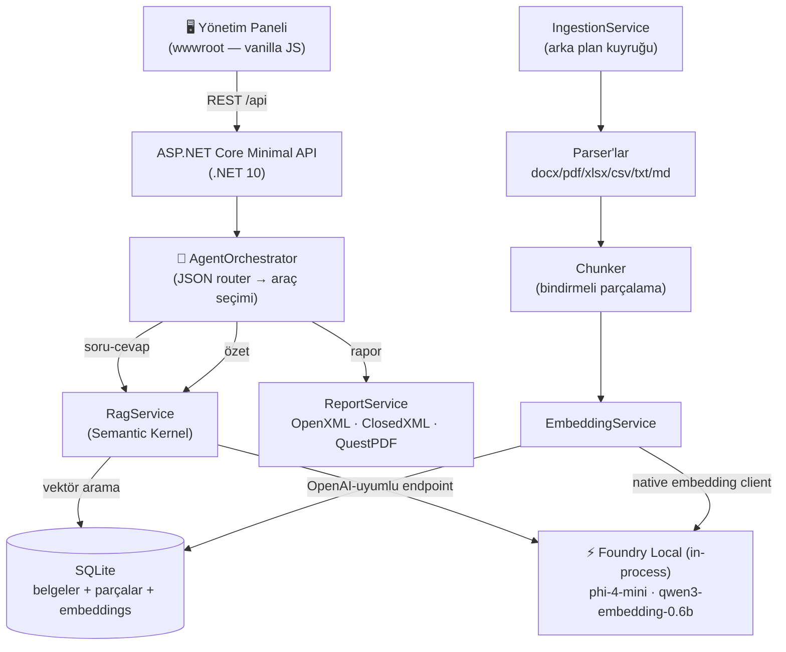

# ⚡ Foundry Local RAG Agent

> **%100 yerel çalışan, agentic RAG tabanlı belge zekâsı paneli.**
> Microsoft Foundry Local + Semantic Kernel + .NET 10 — internet bağlantısı ve bulut API anahtarı gerektirmez.

**EN:** A fully local, agentic RAG document-intelligence dashboard built with **Microsoft Foundry Local**, **Semantic Kernel** and **.NET 10**. Upload Word/PDF/Excel documents, chat with them (with source citations), get summaries, and generate downloadable **Word / Excel / PDF reports** — all inference runs on-device, no cloud, no API keys.

---

## Ne Yapar?

| Özellik | Açıklama |
|---------|----------|
| 📄 **Belge içe aktarma** | `.docx`, `.pdf`, `.xlsx`, `.csv`, `.txt`, `.md` dosyalarını parçalara böler, embedding üretir, SQLite'a yazar |
| 💬 **Kaynak göstermeli sohbet** | Sorular yalnızca yüklü belgelerdeki bilgiyle cevaplanır; cevabın dayandığı parçalar gösterilir |
| 📋 **Özetleme** | Uzun belgelerde map-reduce stratejisiyle (parça özetleri → birleşik özet) çalışır |
| 📊 **Rapor üretimi** | "Satış verilerinden aylık rapor hazırla" de; ajan **Word / Excel / PDF** dosyası üretir |
| 🤖 **Agentic yönlendirme** | Ajan, mesajına göre doğru aracı seçer: arama, özetleme, rapor üretme, listeleme |
| 🎯 **Belge kapsamı (@bahsetme)** | Sohbette `@dosyaadi` yaz (menü açılır) ya da rapor formunda belge seç — arama yalnızca o belgeye kapsamlanır; ayrıca benzerlik eşiği alakasız belgelerin bağlama sızmasını engeller |
| 💾 **Kalıcı sohbet geçmişi** | Mesajlar kaynak ve rapor bağlarıyla SQLite'a yazılır; sayfa yenilense ya da uygulama yeniden başlasa da konuşma kaldığı yerden görünür |
| 🖥️ **Yönetim paneli** | Türkçe web arayüzü (açık/koyu tema): belgeler, sohbet, raporlar, sistem durumu |

## Mimari



**Akış:** Belge yüklenir → parçalanır → `qwen3-embedding-0.6b` ile vektörlenir → SQLite'ta saklanır.
Soru gelince → soru vektörlenir → kosinüs benzerliğiyle en ilgili parçalar bulunur → bağlam olarak
`phi-4-mini`'ye verilir → cevap kaynaklarla birlikte döner. Rapor istenirse ajan, bağlamdan Markdown/JSON
içerik üretir ve bunu gerçek Word/Excel/PDF dosyasına dönüştürür.

## Teknoloji Kararları

- **Foundry Local (in-process SDK)** — `Microsoft.AI.Foundry.Local.WinML` paketi modeli uygulama içinde
  çalıştırır: ayrı servis kurulumu yok, model indirme/donanım hızlandırma (CPU/GPU/NPU) otomatik.
- **Semantic Kernel** — Foundry Local'ın açtığı OpenAI-uyumlu endpoint'e `AddOpenAIChatCompletion` ile
  bağlanır; sohbet, özet ve rapor istemleri SK üzerinden yürür.
- **JSON router (function calling yerine)** — Küçük yerel modellerde native tool-calling henüz güvenilir
  olmadığından araç seçimi, düşük sıcaklıklı bir JSON sınıflandırma istemiyle yapılır ve hatalı JSON'da
  güvenli şekilde sohbete düşülür. Model desteği geldiğinde `FunctionChoiceBehavior.Auto()`'ya geçiş tek
  noktadan mümkün.
- **SQLite + kaba kuvvet kosinüs** — Bu ölçekte (≤ on binlerce parça) harici vektör veritabanına gerek yok;
  embedding'ler normalize edilip BLOB olarak saklanır, arama milisaniyeler sürer.

## Kurulum ve Çalıştırma

### Gereksinimler
- Windows 10 (18362+) / Windows 11
- [.NET 10 SDK](https://dotnet.microsoft.com/download/dotnet/10.0)
- ~4 GB boş disk (ilk çalıştırmada modeller otomatik iner)

### Çalıştır

```bash
git clone https://github.com/<kullanici>/foundry-local-rag-agent.git
cd foundry-local-rag-agent
dotnet run --project src/FoundryRag.Api
```

Tarayıcıda **http://localhost:8743** adresini aç. İlk açılışta Foundry Local; donanım hızlandırma
bileşenlerini ve modelleri (`phi-4-mini` ≈ 3,5 GB + `qwen3-embedding-0.6b` ≈ 0,6 GB) indirir — ilerlemeyi
**Durum** sekmesinden izleyebilirsin. Sonraki açılışlar önbellekten saniyeler içinde yüklenir.

> Model değiştirmek için `src/FoundryRag.Api/appsettings.json` → `Foundry:ChatModelAlias`
> (örn. `qwen2.5-1.5b-instruct` daha hızlı/hafif bir alternatiftir).

## API Uç Noktaları

| Metot | Yol | Açıklama |
|-------|-----|----------|
| GET | `/api/status` | Çalışma zamanı + model + depo durumu |
| GET | `/api/documents` | Belge listesi |
| POST | `/api/documents/upload` | Çoklu dosya yükleme (multipart) |
| DELETE | `/api/documents/{id}` | Belgeyi ve parçalarını sil |
| POST | `/api/documents/{id}/summarize` | Belgeyi özetle |
| POST | `/api/chat` | Agentic sohbet (akışsız) — `{message, history}` |
| POST | `/api/chat/stream` | **SSE akışlı** agentic sohbet — olaylar: `status` / `sources` / `delta` / `report` / `done` / `error` |
| GET | `/api/chat/history` | Kalıcı sohbet geçmişi (kaynak + rapor bağlarıyla) |
| DELETE | `/api/chat/history` | Sohbet geçmişini temizle |
| GET | `/api/reports` | Rapor listesi |
| POST | `/api/reports` | Rapor üret — `{instruction, format: docx\|xlsx\|pdf, documentId?: number}` (documentId verilirse yalnız o belgeden) |
| GET | `/api/reports/{id}/download` | Raporu indir |
| DELETE | `/api/reports/{id}` | Raporu sil |

## Proje Yapısı

```
src/FoundryRag.Api/
├── Program.cs                  # Minimal API uç noktaları + DI
├── Services/
│   ├── FoundryService.cs       # Foundry Local yaşam döngüsü (tek SDK teması noktası)
│   ├── RagService.cs           # Semantic Kernel: RAG cevaplama + özetleme
│   ├── AgentOrchestrator.cs    # JSON router → araç seçimi + rapor akışı
│   ├── IngestionService.cs     # Arka plan içe aktarma kuyruğu
│   ├── DocumentParsers.cs      # docx/pdf/xlsx/csv/txt/md ayrıştırıcıları
│   ├── Chunker.cs              # Bindirmeli metin parçalama
│   ├── EmbeddingService.cs     # Vektörleme + normalizasyon
│   ├── VectorStore.cs          # SQLite: belgeler/parçalar/raporlar + kosinüs arama
│   └── ReportService.cs        # Markdown/JSON → Word/Excel/PDF
└── wwwroot/                    # Yönetim paneli (index.html, styles.css, app.js)
```

## Yol Haritası

- [x] Streaming cevaplar (SSE) — sohbet, özet ve rapor akışı kelime kelime / durum olaylarıyla
- [x] Sohbet geçmişinin SQLite'ta kalıcılaştırılması
- [ ] Var olan Word/Excel dosyasında yerinde düzenleme
- [ ] Native function calling'e geçiş (Foundry Local model desteği yaygınlaşınca)
- [ ] `sqlite-vec` eklentisiyle ANN indeksleme (çok büyük arşivler için)

## Lisans

MIT

---
*Bu proje, Microsoft Foundry Local Summer School programı kapsamında geliştirilmiştir.*
